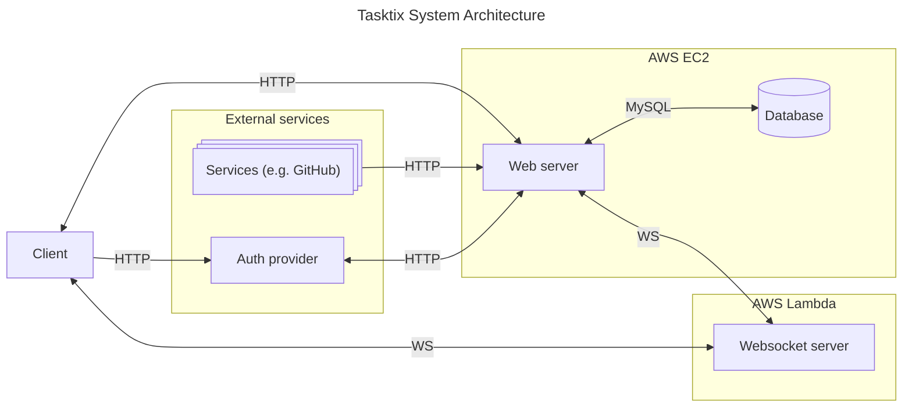
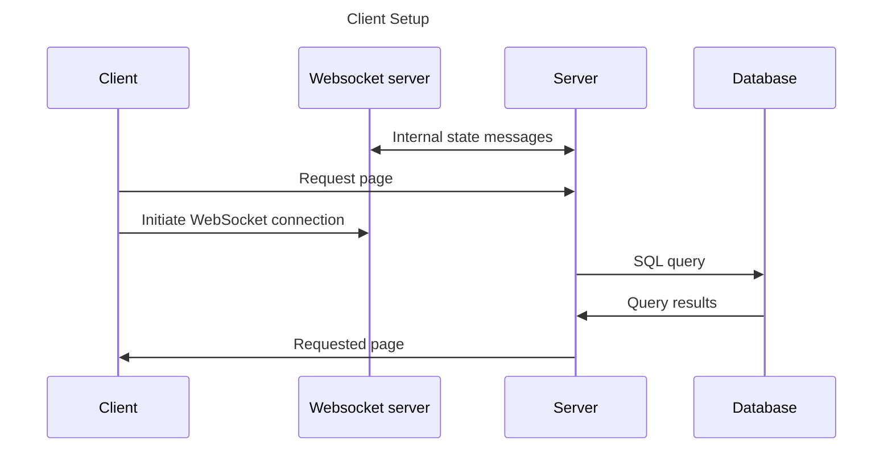
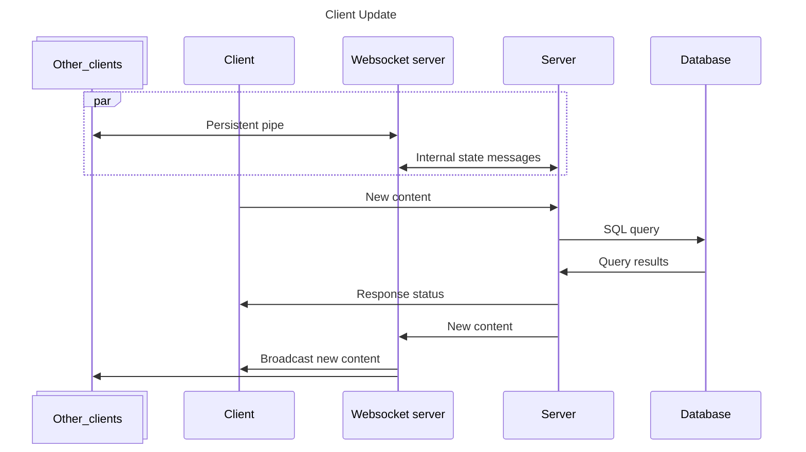

# System Architecture

Tasktix is built from many pieces, shown in the diagram below along with the protocols the
components communicate via.

Some key notes about the architecture design:

- The web server is responsible for performing all persistent state updates after
  authentication & authorization checks. These state updates include starting/ending user
  sessions and persisting user-entered data.
- The websocket server is responsible for letting all clients know when a state change has
  occurred for the list they are viewing (i.e. from another user's interaction). This is
  separated from the main web server because Next.js doesn't natively support websockets.
  Also, AWS Lambda functions scale to zero when not in use, helping reduce costs while our
  user base remains small.
- Tasktix can communicate with other services (e.g. GitHub) over HTTP via webhooks those
  services expose.

## Example Connection Flows

To better understand how the architecture works together, it may be beneficial to look at
some example connections.

This first diagram shows the process of an already-logged in user establishing a
connection to the Tasktix infrastructure. Note the web server's connection to the database
is already active:

After the client has the list data, they can then trigger a request to update the data:

