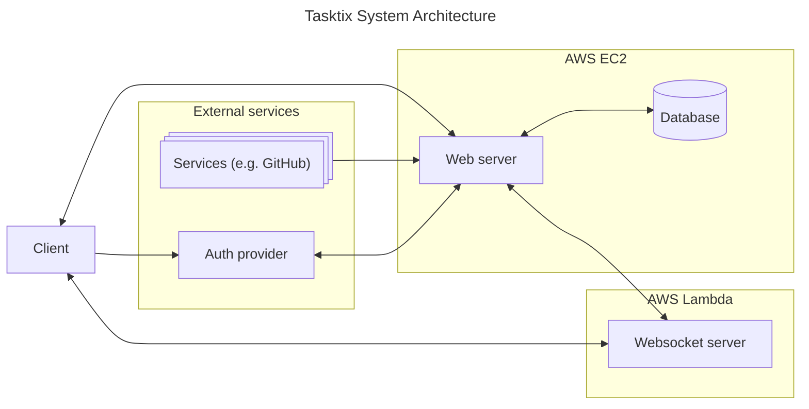
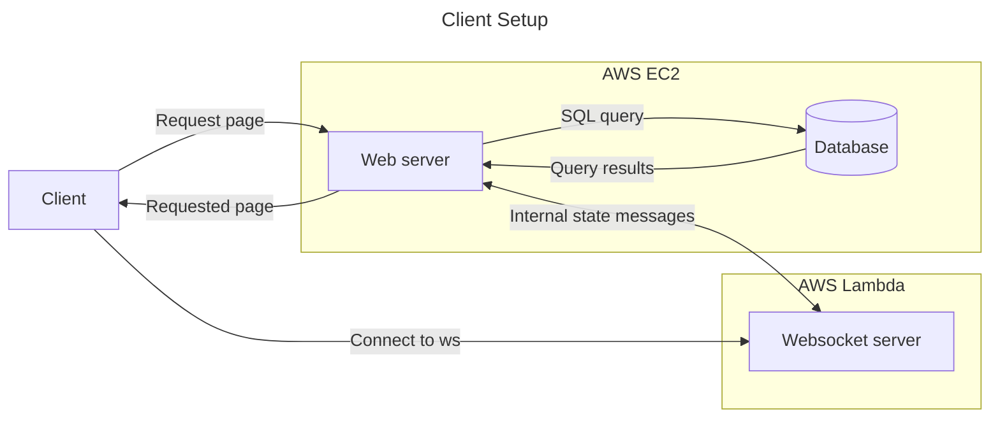
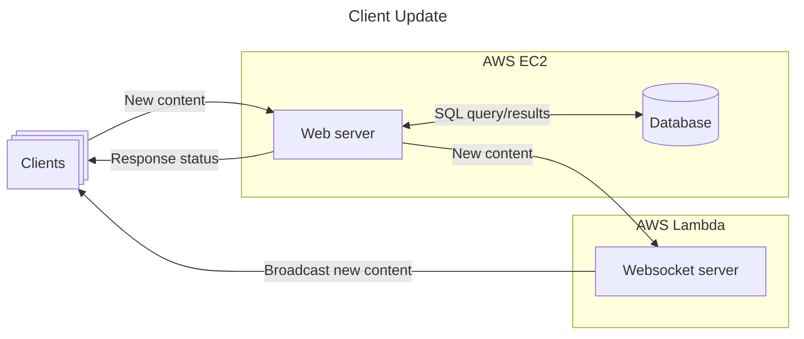

```mermaid
---
title: Tasktix System Architecture
---
flowchart LR
  c[Client]
  subgraph AWS EC2
    
    s[Web server]
    
    d@{shape: cyl, label: Database}
  
  end
  subgraph AWS Lambda
    w[Websocket server]
  end

  subgraph External services
    g@{shape: processes, label: Services (e.g. GitHub)}
    a[Auth provider]
  end

  c <--> s <--> d
  s <--> w <--> c
  g --> s
  c --> a
  a <--> s
``` 

```mermaid
---
title: Client Setup
---
flowchart LR
  c[Client]
  subgraph AWS EC2
    
    s[Web server]
      
    d@{shape: cyl, label: Database}
  
  end
  subgraph AWS Lambda
    w[Websocket server]
  end

  c -->|Request page| s
  s -->|Requested page| c

  s -->|SQL query| d
  d -->|Query results| s

  s<-->|Internal state messages|w
  c-->|Connect to ws|w
```

```mermaid
---
title: Client Update
---
flowchart LR
  c@{shape: processes, label: Clients}
  
  subgraph AWS EC2
    
    s[Web server]
    
    d@{shape: cyl, label: Database}
  
  end
  subgraph AWS Lambda
    w[Websocket server]
  end

  c -->|New content| s
  s -->|Response status| c

  s <-->|SQL query/results| d

  s-->|New content|w
  w-->|Broadcast new content|c
```
