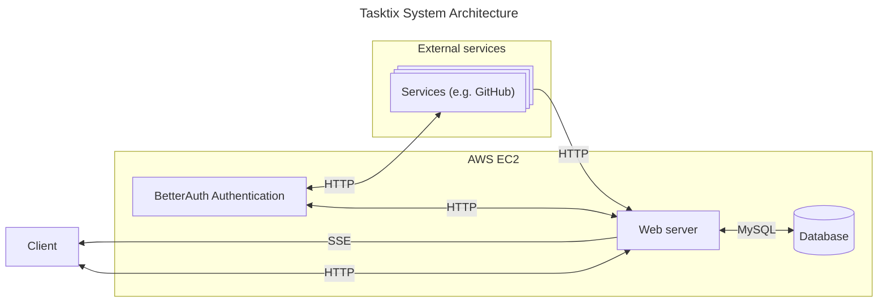
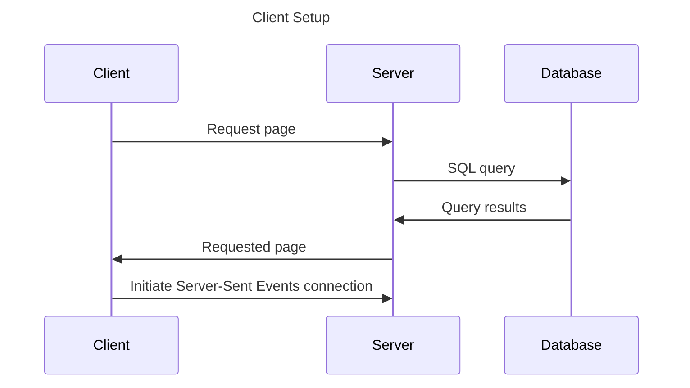
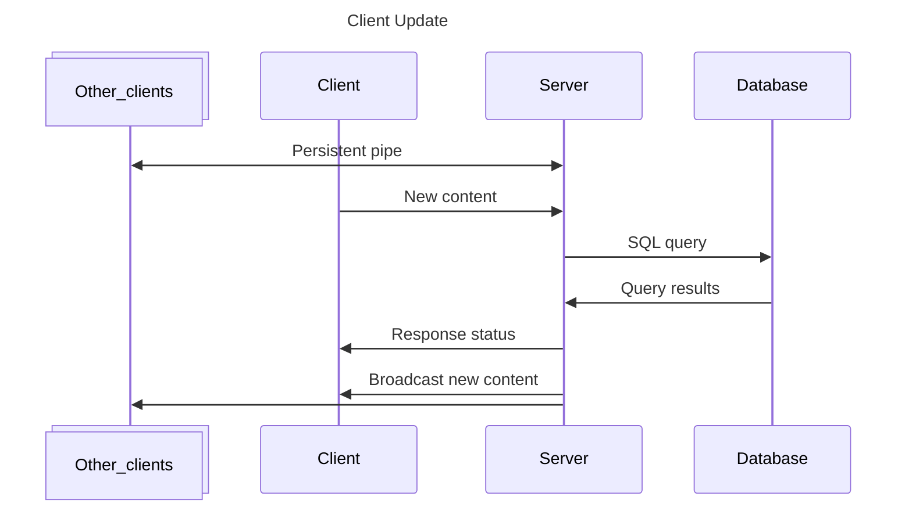

# System Architecture

Tasktix is built from many pieces, shown in the diagram below along with the protocols the
components communicate via.

Some key notes about the architecture design:

- The web server is responsible for performing all persistent state updates after
  authentication & authorization checks. These state updates include starting/ending user
  sessions and persisting user-entered data.
- Tasktix utilizes Server-Sent Events to push state changes to connected clients who are
  viewing a list that is shared by multiple clients (e.g. multiple User accounts or a
  single User on a mobile device and desktop)
- Better Auth Authentication operates similar to a microservice, but contained within the
  Tasktix web server. It has additional communication with the external services such as
  GitHub to provide OAuth/Social Sign On.
- Tasktix can communicate with other services (e.g. GitHub) over HTTP via webhooks those
  services expose.

## Example Connection Flows

To better understand how the architecture works together, it may be beneficial to look at
some example connections.

This first diagram shows the process of an already-logged in user establishing a
connection to the Tasktix infrastructure. Note the web server's connection to the database
is already active:

After the client has the list data, they can then trigger a request to update the data:

